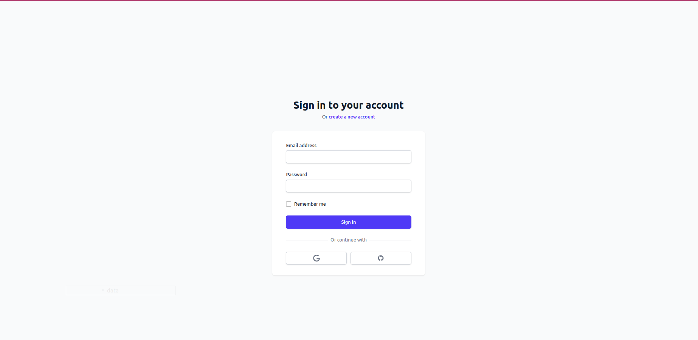
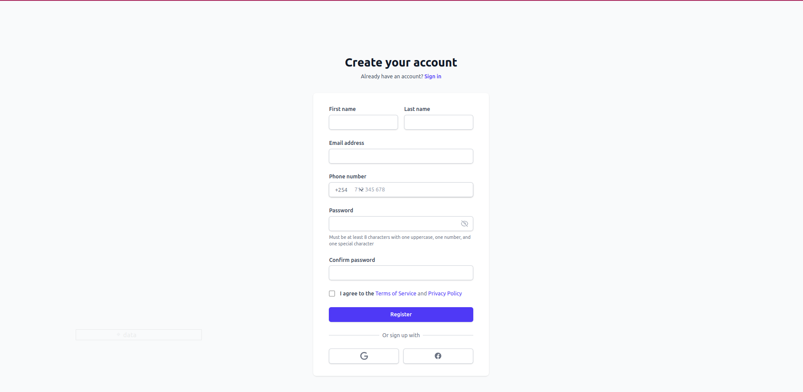
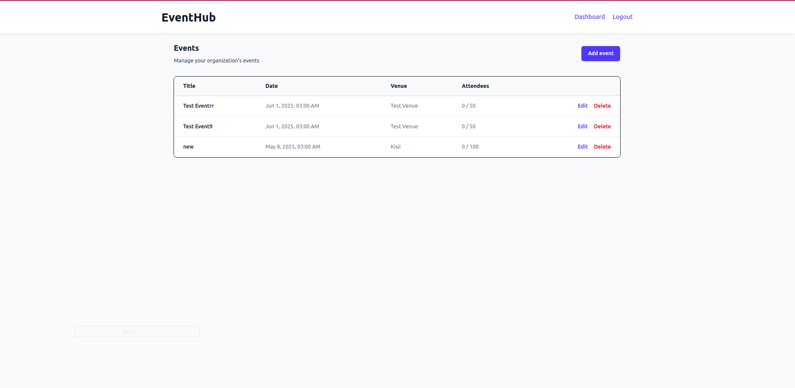
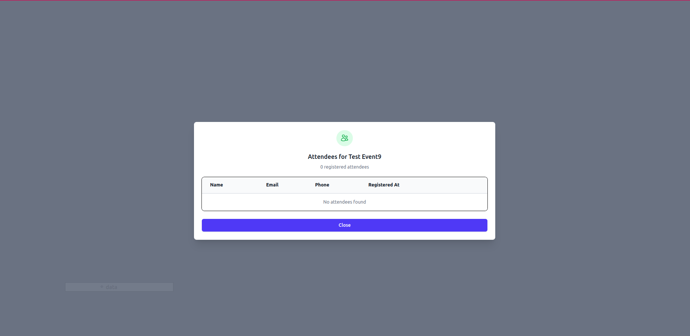
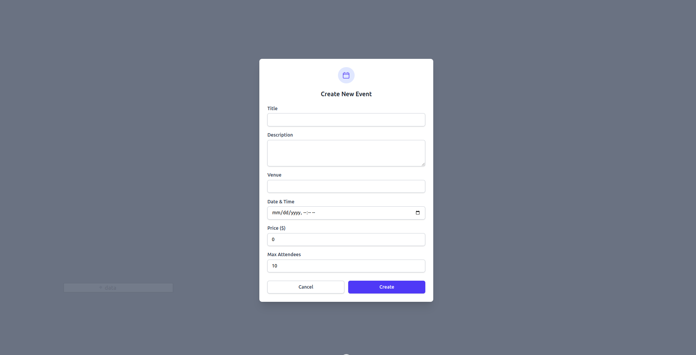
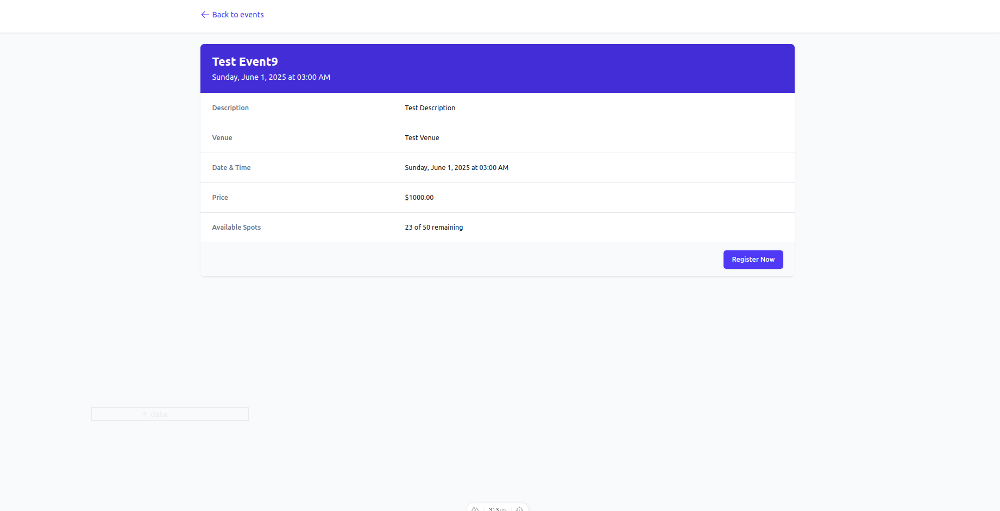
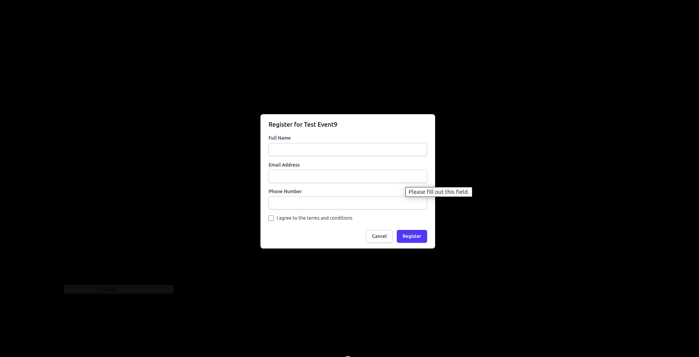

# Solutech Events Platform

This is a full-stack event management application built with:

- **Laravel** (PHP) for the backend API (`/backend`)
- **Nuxt 3** (Vue.js) for the frontend client (`/frontend`)

Both applications live in a single repository for easier development and deployment.

---

##  Folder Structure

```

/
├── backend/     # Laravel 10 backend API
├── frontend/    # Nuxt 3 frontend app
├── start.sh     # Script to start both apps
├── setup.sh     # One-time setup and launch script
└── README.md

````


## 🚀 Quick Start

After cloning the repository:

### 🐧 On Linux

```bash
git clone https://github.com/JAPHETHNYARANGA/solutech-events.git
cd solutech-events

# 1. Make the scripts executable (only needed once)
chmod +x setup.sh start.sh

# 2. Run the setup script
./setup.sh
🪟 On Windows (WSL/Git Bash)
bash
Copy
Edit
# 1. Convert line endings to Unix-style (if cloned on Windows)
dos2unix setup.sh start.sh

# 2. Add execute permission
chmod +x setup.sh start.sh

# 3. Run the setup script
./setup.sh
This will:

Install backend (Laravel) and frontend (Nuxt) dependencies

Set up Laravel .env and generate an app key

Run database migrations (optional)

Start both servers concurrently

---

## ✅ Requirements

Make sure you have the following installed:

* PHP >= 8.1
* Composer
* Node.js >= 18
* NPM
* MySQL
* Git

---

## 🔧 Laravel Backend

**Path:** `/backend`

* REST API for events and organizations
* `.env.example` provided
* Runs on: `http://127.0.0.1:8000`


After setup, update your .env file in the backend/ folder with your local MySQL database credentials:

DB_CONNECTION=mysql
DB_HOST=127.0.0.1
DB_PORT=3306
DB_DATABASE=your_database
DB_USERNAME=your_username
DB_PASSWORD=your_password
Runs on: http://127.0.0.1:8000

---

## 🌐 Nuxt Frontend

**Path:** `/frontend`

* Built using Nuxt 3 (Vue 3)
* Tailwind CSS and Headless UI for styling
* Runs on: `http://localhost:3000`

---

## 🖥 Development Workflow

Start both servers at once using:

```bash
./start.sh

This launches:

* Laravel backend on port 8000
* Nuxt frontend on port 3000

Press `Ctrl + C` to stop both.

---

## 📸 Screenshots








---

## 🛠 Future Improvements

* Docker support
* CI/CD setup
* Unit & Feature tests
* Role-based access control

